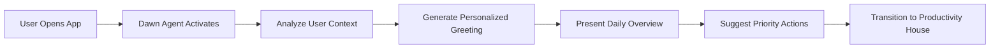

# Life OS - Gamified Productivity Platform
## Project Specification Document v1.0

---

## 🎮 Executive Summary

Life OS is a web-based gamified productivity platform that transforms daily task management and journaling into an engaging, pixelated adventure. The application features proactive AI agents that guide users through their day, creating a personalized productivity experience with delightful animations powered by Anime.js.

### Core Vision
- **Gamified Productivity**: Transform mundane tasks into engaging quests
- **AI-Powered Guidance**: Proactive agents that understand and adapt to user patterns
- **Delightful Interactions**: Smooth, dopamine-inducing animations for every action
- **Emotional Intelligence**: Mood-aware journaling with atmospheric environments

---

## 🏗️ System Architecture

### Technology Stack
```yaml
Frontend:
  - Framework: Next.js 15 (App Router)
  - UI Components: shadcn/ui
  - Animations: Anime.js
  - Styling: Tailwind CSS
  - State Management: Zustand
  - AI Integration: Vercel AI SDK (with streaming)
  - Type Safety: TypeScript

Backend:
  - Runtime: Node.js
  - API: Next.js API Routes
  - Database: PostgreSQL with Drizzle ORM
  - Real-time: Vercel AI SDK streaming
  - AI Models: OpenAI/Anthropic via Vercel AI SDK
  - Authentication: Auth.js (NextAuth)

Infrastructure:
  - Hosting: Vercel/Railway
  - Database: Supabase/Neon
  - File Storage: Cloudinary/S3
  - Analytics: PostHog
```

---

## 🎭 Core Features & User Flows

### 1. AI Welcome Agent - "Dawn"
The first interaction point that sets the tone for the user's day.

#### User Flow:


#### Features:
- **Contextual Awareness**: Time of day, weather, calendar events
- **Emotional Check-in**: Mood assessment with visual feedback
- **Smart Suggestions**: Based on patterns, deadlines, and goals
- **Daily Motivation**: Personalized quotes and achievements

#### Animation Sequences:
```javascript
// Dawn Agent entrance animation
const dawnEntrance = anime.timeline({
  easing: 'easeOutExpo',
})
.add({
  targets: '.agent-avatar',
  scale: [0, 1],
  rotate: '1turn',
  duration: 800
})
.add({
  targets: '.greeting-text',
  translateY: [20, 0],
  opacity: [0, 1],
  duration: 600,
  delay: anime.stagger(100)
})
.add({
  targets: '.suggestion-cards',
  translateX: [-50, 0],
  opacity: [0, 1],
  duration: 500,
  delay: anime.stagger(150)
});
```

### 2. Productivity House
A visual metaphor for different life areas, each room representing a domain.

#### Room Layout:
```
┌─────────────────────────────────────┐
│          Productivity House          │
├──────────┬──────────┬───────────────┤
│  Study   │  Work    │   Wellness    │
│  Room    │  Office  │   Garden      │
├──────────┼──────────┼───────────────┤
│ Creative │  Social  │   Finance     │
│  Studio  │  Lounge  │   Vault       │
├──────────┴──────────┴───────────────┤
│         Central Hub (Tasks)          │
└─────────────────────────────────────┘
```

#### Navigation Mechanics:
- **Hover Effects**: Rooms glow and pulse
- **Click Transitions**: Smooth zoom-in with parallax
- **Activity Indicators**: Live updates showing task counts
- **Achievement Badges**: Displayed on completed rooms

---

## 📝 Detailed Use Cases

### Use Case 1: Morning Check-in Routine

**Actor**: Regular User (Sarah)
**Precondition**: User has existing tasks and journal entries
**Trigger**: Opens application at 8:00 AM

**Main Flow**:
1. Application loads with sunrise animation
2. Dawn agent materializes with personalized greeting
3. Agent says: "Good morning, Sarah! I noticed you have 3 important tasks today."
4. Mood check interface slides in with emoji selection
5. Sarah selects "Energetic" mood
6. Dawn responds with matching energy: "Perfect energy for tackling that presentation!"
7. Daily overview cards animate in:
   - Calendar snippet (2 meetings)
   - Priority tasks (3 items)
   - Journal streak (5 days)
8. Dawn suggests: "Start with the client proposal - your focus peaks in the morning"
9. Sarah clicks suggestion
10. Smooth transition to Work Office room
11. Task interface opens with the proposal task highlighted

**Alternative Flows**:
- A1: User selects "Tired" mood
  - Dawn adjusts suggestions to lighter tasks
  - Offers energizing tips or break reminders
- A2: User has overdue tasks
  - Dawn gently highlights them with recovery plan
  - Suggests time-blocking for catch-up

**Postcondition**: User is oriented and ready to start productive work

### Use Case 2: Task Completion Celebration

**Actor**: User completing a major task
**Precondition**: Task marked as "high priority"
**Trigger**: User checks off completed task

**Main Flow**:
1. Checkbox animates with satisfying "check" motion
2. Task card bursts into pixel particles
3. XP numbers float upward (+150 XP)
4. Streak counter increments with fire effect
5. If milestone reached:
   - Full-screen celebration animation
   - New badge unlocked notification
   - Dawn agent appears with congratulations
6. Related tasks reorganize with smooth transitions
7. Progress bar fills with liquid animation
8. Productivity score updates with counter animation

### Use Case 3: Evening Reflection Journal

**Actor**: User doing daily journaling
**Precondition**: Evening time (after 7 PM)
**Trigger**: User clicks Journal room

**Main Flow**:
1. Transition to cozy Journal room environment
2. Candlelight flicker animation begins
3. Pixelated book opens with page flip animation
4. Reflection agent "Luna" appears with prompt
5. Luna says: "What moment from today deserves to be remembered?"
6. User begins typing
7. Each keystroke triggers:
   - Subtle sparkle effects
   - Gentle sound feedback
   - Character count with milestone rewards
8. After paragraph completion:
   - Firework animation
   - Mood analysis visualization appears
9. Luna provides insight: "I notice growth in how you handled that challenge"
10. Entry saves with book closing animation
11. Daily streak updates

---

## 🤖 AI Agent System

### Agent Architecture

```typescript
interface Agent {
  id: string;
  name: string;
  personality: PersonalityTraits;
  domain: LifeDomain;
  capabilities: Capability[];
  triggerConditions: TriggerRule[];
  responsePatterns: ResponseTemplate[];
}

enum LifeDomain {
  WELCOME = "welcome",
  PRODUCTIVITY = "productivity",
  REFLECTION = "reflection",
  WELLNESS = "wellness",
  LEARNING = "learning"
}
```

### Agent Profiles

#### 1. Dawn - Welcome Agent
```yaml
personality:
  - trait: Energetic
  - trait: Encouraging
  - trait: Contextually-aware
capabilities:
  - Daily briefing generation
  - Mood assessment
  - Priority suggestion
  - Pattern recognition
triggers:
  - App launch
  - Morning hours (5 AM - 12 PM)
  - Return after absence
```

#### 2. Atlas - Task Agent
```yaml
personality:
  - trait: Organized
  - trait: Strategic
  - trait: Motivating
capabilities:
  - Task prioritization
  - Time estimation
  - Deadline management
  - Productivity coaching
triggers:
  - Task creation/completion
  - Productivity room entry
  - Overdue task detection
```

#### 3. Luna - Reflection Agent
```yaml
personality:
  - trait: Thoughtful
  - trait: Empathetic
  - trait: Insightful
capabilities:
  - Prompt generation
  - Sentiment analysis
  - Pattern identification
  - Growth tracking
triggers:
  - Journal room entry
  - Evening hours
  - Emotional keywords
```

---

## 🎨 Visual Design System

### Pixel Art Aesthetic
```css
/* Global pixel style */
.pixel-perfect {
  image-rendering: pixelated;
  image-rendering: -moz-crisp-edges;
  image-rendering: crisp-edges;
}

/* Color Palette */
:root {
  /* Primary Colors */
  --pixel-purple: #6B46C1;
  --pixel-blue: #3B82F6;
  --pixel-green: #10B981;
  
  /* Mood Colors */
  --energy-yellow: #FCD34D;
  --calm-blue: #93C5FD;
  --focus-purple: #C084FC;
  
  /* UI Colors */
  --bg-dark: #1F2937;
  --bg-light: #F3F4F6;
  --accent-fire: #EF4444;
}
```

### Animation Patterns

#### Micro-interactions
```javascript
// Button hover effect
const buttonHover = {
  scale: 1.05,
  rotate: [-1, 1],
  duration: 300,
  easing: 'easeOutElastic(1, 0.5)'
};

// Task complete effect
const taskComplete = anime({
  targets: '.task-item',
  translateX: [0, 10, 0],
  opacity: [1, 0.5, 0],
  easing: 'easeOutExpo',
  duration: 800
});

// XP gain animation
const xpGain = anime({
  targets: '.xp-counter',
  innerHTML: [currentXP, newXP],
  round: 1,
  easing: 'linear',
  duration: 1000,
  update: function() {
    // Trigger particle effect every 100 XP
  }
});
```

#### Page Transitions
```javascript
const roomTransition = anime.timeline({
  easing: 'easeOutQuad',
})
.add({
  targets: '.current-room',
  scale: [1, 0.9],
  opacity: [1, 0],
  duration: 400
})
.add({
  targets: '.new-room',
  scale: [1.1, 1],
  opacity: [0, 1],
  duration: 600,
  offset: '-=200'
});
```

---

## 📊 Gamification Mechanics

### XP & Leveling System
```typescript
const levelSystem = {
  baseXP: 100,
  multiplier: 1.5,
  
  calculateLevel: (totalXP: number) => {
    return Math.floor(Math.log(totalXP / 100) / Math.log(1.5)) + 1;
  },
  
  rewards: {
    5: 'New Theme: Cosmic',
    10: 'Agent Customization',
    15: 'Advanced Analytics',
    20: 'Master Badge'
  }
};
```

### Achievement System
```typescript
interface Achievement {
  id: string;
  name: string;
  description: string;
  icon: string;
  condition: AchievementCondition;
  reward: Reward;
  rarity: 'common' | 'rare' | 'epic' | 'legendary';
}

const achievements = [
  {
    id: 'early-bird',
    name: 'Early Bird',
    description: 'Complete 5 tasks before 9 AM',
    condition: { type: 'time-based', count: 5, before: '09:00' },
    reward: { xp: 500, badge: 'sunrise-badge' },
    rarity: 'rare'
  },
  {
    id: 'flow-state',
    name: 'Flow State',
    description: 'Complete 10 tasks in one session',
    condition: { type: 'streak', count: 10 },
    reward: { xp: 1000, theme: 'matrix-theme' },
    rarity: 'epic'
  }
];
```

---

## 🔄 State Management

### Application State Structure
```typescript
interface AppState {
  user: UserProfile;
  agents: Agent[];
  tasks: Task[];
  journal: JournalEntry[];
  gameState: GameState;
  ui: UIState;
}

interface GameState {
  level: number;
  xp: number;
  streaks: StreakData;
  achievements: Achievement[];
  unlockedFeatures: Feature[];
}

interface UIState {
  currentRoom: RoomType;
  activeAgent: Agent | null;
  animations: AnimationQueue;
  theme: Theme;
  mood: MoodType;
}
```

---

## 🚀 Implementation Roadmap

### Phase 1: Foundation (Weeks 1-2)
- [ ] Next.js 15 project setup with TypeScript
- [ ] shadcn/ui installation and theme configuration
- [ ] Drizzle ORM setup with PostgreSQL
- [ ] Design system implementation with Tailwind CSS
- [ ] Basic Anime.js integration and animation presets
- [ ] Authentication with NextAuth v5
- [ ] Database schema design with Drizzle

### Phase 2: Core Features (Weeks 3-5)
- [ ] Dawn welcome agent
- [ ] Productivity house navigation
- [ ] Basic task management
- [ ] XP and level system
- [ ] Animation library development

### Phase 3: AI Integration (Weeks 6-7)
- [ ] Agent personality system
- [ ] Context analysis engine
- [ ] Smart suggestions algorithm
- [ ] Natural language processing
- [ ] Pattern recognition

### Phase 4: Journaling (Weeks 8-9)
- [ ] Journal room environment
- [ ] Luna reflection agent
- [ ] Mood tracking system
- [ ] Writing animations
- [ ] Insight generation

### Phase 5: Gamification (Weeks 10-11)
- [ ] Achievement system
- [ ] Streak tracking
- [ ] Reward animations
- [ ] Leaderboards (optional)
- [ ] Custom themes unlocking

### Phase 6: Polish (Weeks 12)
- [ ] Performance optimization
- [ ] Bug fixes
- [ ] User testing
- [ ] Documentation
- [ ] Deployment

---

## 🔌 API Specification

### RESTful Endpoints
```yaml
Authentication:
  POST   /api/auth/login
  POST   /api/auth/logout
  POST   /api/auth/refresh

User:
  GET    /api/user/profile
  PATCH  /api/user/settings
  GET    /api/user/stats

Tasks:
  GET    /api/tasks
  POST   /api/tasks
  PATCH  /api/tasks/:id
  DELETE /api/tasks/:id
  POST   /api/tasks/:id/complete

Journal:
  GET    /api/journal/entries
  POST   /api/journal/entries
  PATCH  /api/journal/entries/:id
  GET    /api/journal/insights

Agents:
  GET    /api/agents/suggestions
  POST   /api/agents/interact
  GET    /api/agents/:id/history

Gamification:
  GET    /api/game/achievements
  GET    /api/game/leaderboard
  POST   /api/game/claim-reward
```

---

## 📈 Analytics & Metrics

### Key Performance Indicators
- Daily Active Users (DAU)
- Task Completion Rate
- Journal Entry Frequency
- Streak Retention Rate
- Feature Adoption Rate
- Agent Interaction Rate

### User Engagement Metrics
```typescript
const trackEvent = (event: AnalyticsEvent) => {
  analytics.track({
    event: event.type,
    properties: {
      ...event.data,
      timestamp: Date.now(),
      session: sessionId,
      mood: currentMood,
      level: userLevel
    }
  });
};
```

---

## 🛡️ Security & Privacy

### Data Protection
- End-to-end encryption for journal entries
- Secure authentication with JWT
- Rate limiting on API endpoints
- GDPR compliance for user data
- Regular security audits

### Privacy Features
- Local-first data storage option
- Encrypted cloud sync
- Data export functionality
- Account deletion with full data removal
- Anonymous usage mode

---

## 📱 Responsive Design

### Breakpoint Strategy
```css
/* Mobile First Approach */
@media (min-width: 640px) { /* Tablet */ }
@media (min-width: 1024px) { /* Desktop */ }
@media (min-width: 1280px) { /* Large Desktop */ }
```

### Touch Interactions
- Swipe gestures for room navigation
- Long press for task options
- Pinch to zoom on productivity house
- Pull to refresh for updates

---

## 🔄 Future Enhancements

### Version 2.0 Features
- **Voice Commands**: Natural language task creation
- **AR Mode**: Augmented reality task visualization
- **Social Features**: Team productivity spaces
- **Advanced AI**: Predictive task generation
- **Integrations**: Calendar, Slack, Notion sync
- **Mobile Apps**: Native iOS/Android applications
- **Wellness Tracking**: Health and habit integration
- **Custom Agents**: User-created AI personalities

---

## 📚 Technical Dependencies

```json
{
  "dependencies": {
    "next": "^15.0.0",
    "react": "^19.0.0",
    "react-dom": "^19.0.0",
    "@ai-sdk/openai": "^0.0.40",
    "@ai-sdk/anthropic": "^0.0.30",
    "ai": "^3.3.0",
    "drizzle-orm": "^0.33.0",
    "postgres": "^3.4.0",
    "animejs": "^3.2.1",
    "zustand": "^4.5.0",
    "next-auth": "^5.0.0",
    "@radix-ui/react-dialog": "^1.0.0",
    "@radix-ui/react-dropdown-menu": "^2.0.0",
    "@radix-ui/react-toast": "^1.0.0",
    "class-variance-authority": "^0.7.0",
    "clsx": "^2.1.0",
    "tailwind-merge": "^2.2.0",
    "tailwindcss": "^3.4.0",
    "lucide-react": "^0.400.0",
    "date-fns": "^3.0.0",
    "zod": "^3.22.0"
  },
  "devDependencies": {
    "@types/node": "^20.0.0",
    "@types/react": "^19.0.0",
    "typescript": "^5.3.0",
    "drizzle-kit": "^0.24.0",
    "tailwindcss-animate": "^1.0.0",
    "eslint": "^8.0.0",
    "prettier": "^3.0.0"
  }
}
```

---

## 🤝 Team & Roles

### Development Team
- **Product Owner**: Define vision and priorities
- **Full-Stack Developer**: Core implementation
- **UI/UX Designer**: Visual design and interactions
- **AI Engineer**: Agent system and ML features
- **QA Tester**: Quality assurance and testing

---

## 📞 Support & Documentation

### User Documentation
- Getting Started Guide
- Feature Tutorials
- Agent Interaction Guide
- Troubleshooting FAQ
- Video Walkthroughs

### Developer Documentation
- API Reference
- Component Library
- Animation Cookbook
- Deployment Guide
- Contributing Guidelines

---

## 📝 Appendix

### A. Glossary
- **Agent**: AI-powered assistant within the app
- **Productivity House**: Visual metaphor for life domains
- **XP**: Experience points earned through task completion
- **Streak**: Consecutive days of activity
- **Room**: Thematic area within productivity house

### B. References
- Anime.js Documentation
- Gamification Best Practices
- Productivity Psychology Research
- AI Agent Design Patterns

---

*Document Version: 1.0*
*Last Updated: November 2024*
*Status: In Development*